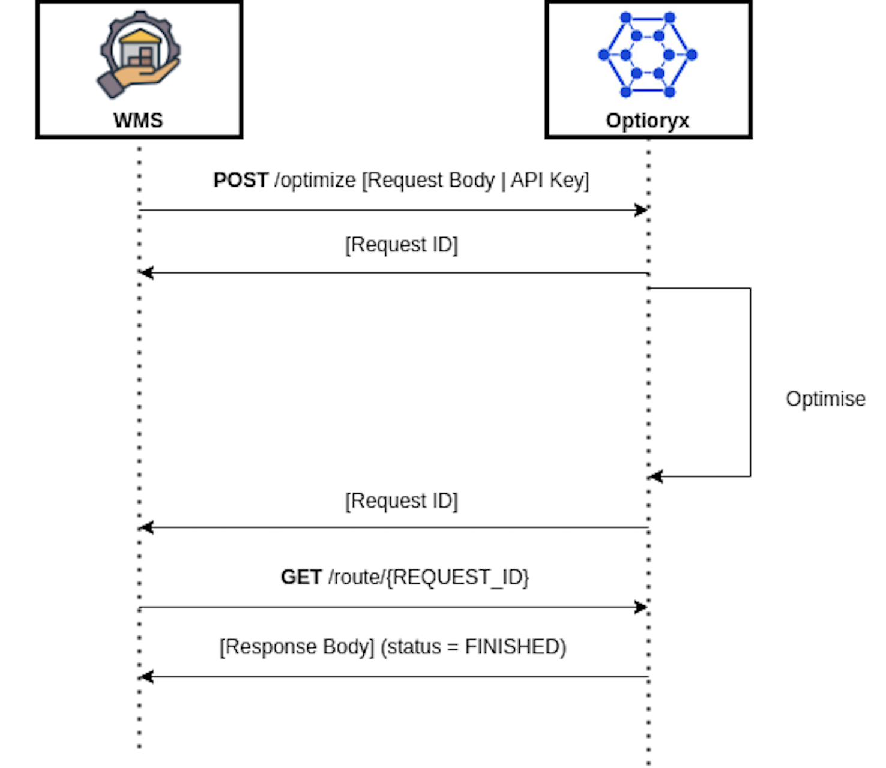

<br/><br/><p align="center">
  
</p><br/><br/>

# Introduction to OptiPick Webhooks

Webhooks allow services to notify each other of events. At their core, they are simply `POST` requests sent to a pre-determined endpoint. You can define your own endpoints in our web application and configure different endpoints for various combinations of *event types*. 

<br/><br/><p align="center">
  
</p><br/><br/>

OptiPick supports the following event types:

- **`route.optimized`**: Triggered when a request to our routing API completes for **any** of your operational warehouses.
- **`cluster.optimized`**: Triggered when a request to our clustering API completes for **any** of your operational warehouses.
- **`route.optimized.{warehouse name}.{your user id}`**: Triggered when a request to our routing API completes for a specific `{warehouse name}`.
- **`cluster.optimized.{warehouse name}.{your user id}`**: Triggered when a request to our clustering API completes for a specific `{warehouse name}`.

Once subscribed to one or more types, your endpoint receives small messages whenever the chosen events occur. These messages include the `ID` of the completed request, which can be used to fetch further details from our REST API.

This minimal Flask application demonstrates how your webhook endpoint should process events. For incoming `cluster.optimized.{warehouse name}.{your user id}` events, the example verifies the payload using request headers and your endpoint's ***secret***. Additionally, it showcases how to use our REST API to retrieve optimization details.

Webhook signatures are a way to verify that webhook messages are sent by us. For a more detailed explanation, check out this article on [why you should verify webhooks](https://docs.svix.com/receiving/verifying-payloads/why). For more instructions and examples of how to verify signatures in different languages, check out Svix' [webhook verification documentation](https://docs.svix.com/receiving/verifying-payloads/how).


## Setting Up Webhooks 

To set up webhooks, navigate to the ***Webhook Dashboard*** under ***Settings*** in the [web application](https://optipick.optioryx.com/settings).


On the webhooks dashboard, you'll see the "Endpoints" page.


Click the "Add Endpoint" button to create a new endpoint. For production, you should deploy your endpoint to a domain or IP accessible by our [webhook workers](https://docs.optioryx.com/optipick-webhooks). For debugging, you can use the [Svix CLI](https://github.com/svix/svix-cli?tab=readme-ov-file#installation) to forward a temporary "playground" endpoint to your localhost. 

After installing the CLI, start your Flask application with:

```bash
python main.py
``` 

Assuming the application runs at `http://127.0.0.1:5000` (check the output of the command above) and your webhook endpoint is `/webhook`, you can forward requests locally using:

```bash
svix listen http://127.0.0.1:5000/webhook
```

The CLI output provides a webhook URL that redirects callbacks to your local machine.


Enter this relay URL in the "Add Endpoint" screen, then select the event types you wish to listen for (e.g., `cluster.optimized` for the "Example" warehouse: `cluster.optimized.Example.673f48095739843f4de65ec9`).


After creating the endpoint, reveal the signing secret to verify calls from our servers. Set the variable `secret` in `main.py` to match this value (and restart the Flask app after any changes).


## Setting Up the REST API

Your app is now ready to receive events containing unique optimization IDs. To fetch a completed optimization's outcome, use this ID and a secret API key to query the [OptiPick API](https://docs.optioryx.com).

To create an API key:

1. Go to the **Settings** page in the [web application](https://optipick.optioryx.com/settings).
2. Click on "API Keys."
3. Generate a new API key.

Set the variable `api_key` in `main.py` to your API key (restart the Flask app after any changes).


## Trying It Out

Once `main.py` contains all the necessary tokens, your app is ready to receive events! Submit the default clustering request for the "Example" warehouse from our [API docs](https://docs.optioryx.com), ensuring your API key is filled in and `synchronous` is set to `false`. After a few seconds, the optimization results should appear in your Flask console.


## Retries
Svix attempts to deliver each webhook message based on a retry schedule with exponential backoff. To test out retries, introduce an intentional fatal error in `main.py`, start an optimization, fix the error, and replay the event via the dashboard. The system marks an event as handled only if your endpoint responds with a `20X` status code.

### The schedule
Each message is attempted based on the following schedule, where each period is started following the failure of the preceding attempt:

-   Immediately
-   5 seconds
-   5 minutes
-   30 minutes
-   2 hours
-   5 hours
-   10 hours
-   10 hours (in addition to the previous)

If an endpoint is removed or disabled delivery attempts to the endpoint will be disabled as well.

For example, an attempt that fails three times before eventually succeeding will be delivered roughly 35 minutes and 5 seconds following the first attempt.

### Manual retries
You can also use the application portal to manually retry each message at any time, or automatically retry ("Recover") all failed messages starting from a given date.

## Troubleshooting Tips
There are some common reasons why your webhook endpoint is failing:

### Not using the raw payload body
This is the most common issue. When generating the signed content, we use the raw string body of the message payload.

If you convert JSON payloads into strings using methods like stringify, different implementations may produce different string representations of the JSON object, which can lead to discrepancies when verifying the signature. It's crucial to verify the payload exactly as it was sent, byte-for-byte or string-for-string, to ensure accurate verification.

### Missing the secret key
From time to time we see people simple using the wrong secret key. Remember that keys are unique to endpoints.

### Sending the wrong response codes
When we receive a response with a 2xx status code, we interpret that as a successful delivery even if you indicate a failure in the response payload. Make sure to use the right response status codes so we know when message are supposed to succeed vs fail.

### Responses timing out
We will consider any message that fails to send a response within 20s a failed message. If your endpoint is also processing complicated workflows, it may timeout and result in failed messages.

We suggest having your endpoint simply receive the message and add it to a queue to be processed asynchronously so you can respond promptly and avoiding getting timed out.

## Failure Recovery

### Re-enable a disabled endpoint
If all attempts to a specific endpoint fail for a period of 5 days, the endpoint will be disabled. To re-enable a disabled endpoint, go to the webhook dashboard, find the endpoint from the list and select "Enable Endpoint".

### Recovering/Resending failed messages

#### Why Replay

-   If your service has downtime
-   If your endpoint was misconfigured

If you want to replay a single event, you can find the message from the UI and click the options menu next to any of the attempts.


From there, click "resend" to have the same message send to your endpoint again.

If you need to recover from a service outage and want to replay all the events since a given time, you can do so from the Endpoint page. On an endpoint's details page, click  `Options > Recover Failed Messages`.


From there, you can choose a time window to recover from.

For a more granular recovery - for example, if you know the exact timestamp that you want to recover from - you can click the options menu on any message from the endpoint page. From there, you can click "Replay..." and choose to "Replay all failed messages since this time."

## IP Whitelist
In case your webhook receiving endpoint is behind a firewall or NAT, you may need to allow traffic from Svix's IP addresses.

This is the full list of IP addresses that webhooks may originate from grouped by the region of the sender:

### US

```
44.228.126.217
50.112.21.217
52.24.126.164
54.148.139.208
```

### EU

```
52.215.16.239
54.216.8.72
63.33.109.123
```